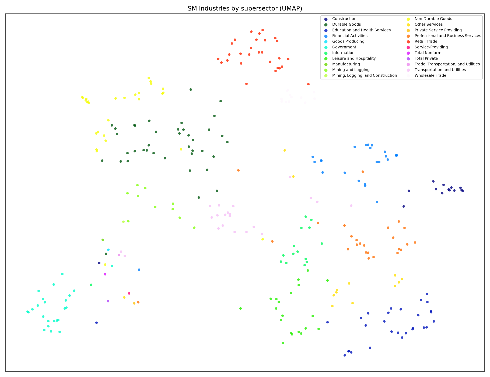
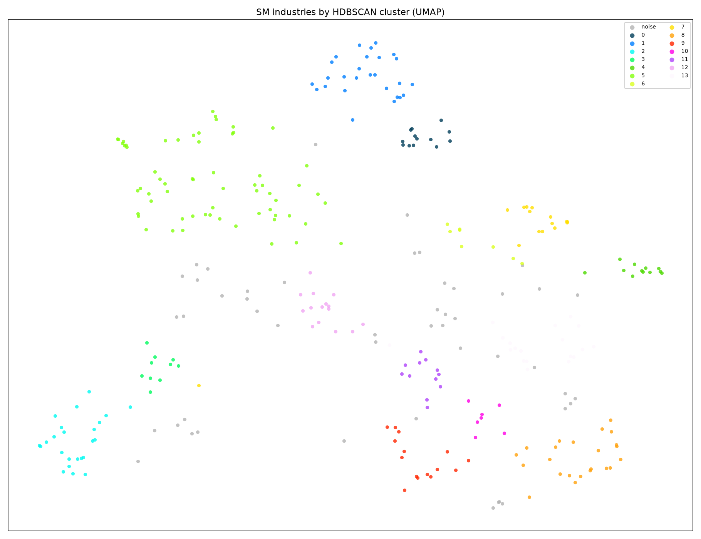
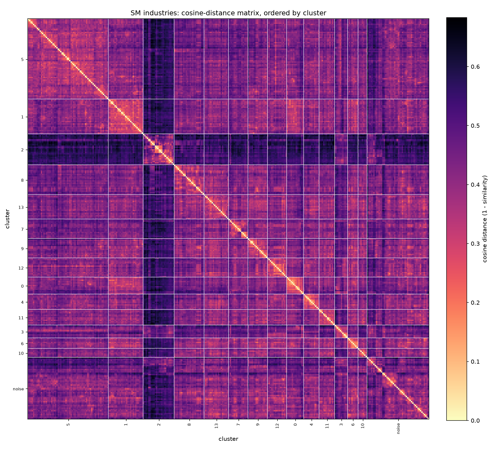

# naics_embedding

Sentence embeddings for **BLS CES State & Area (survey SM)** industries, so you can
measure how close two published series are **by industry**. One 1024-d vector per
unique SM `industry_code` (310 total), plus 2-D projections, clusters, and a
model-ready predictor matrix.

The industry descriptions are enriched with **Census 2022 NAICS** definitional prose,
so closeness reflects what an industry actually *does* — not just its title.

## Visuals

UMAP 2-D projection colored by BLS supersector (left) and by HDBSCAN cluster (right):

| By supersector | By cluster |
|---|---|
|  |  |

Cosine-distance matrix, rows/cols ordered by cluster (bright diagonal blocks = tight
clusters; the dark band is the title-only aggregate rows, far from every real industry):



## What it produces

| File (`out/`) | What it is |
|---|---|
| `embeddings.npy` | float32 `[310, 1024]`, L2-normalized; row order matches `meta.parquet` |
| `meta.parquet` | per-industry metadata (code, name, supersector, naics, tier, sentence) |
| `industry_vectors.parquet` | full 1024-d predictor matrix, keyed by `industry_code` (string) |
| `industry_pca.parquet` / `.csv` | PCA-reduced predictor matrix (90% variance) |
| `cosine_similarity.parquet` | 310×310 full-vector cosine matrix (authoritative closeness) |
| `coords.parquet` | UMAP 2-D coords + HDBSCAN `cluster` + `cluster_prob` |
| `plot_supersector.png`, `plot_cluster.png` | 2-D scatter (by supersector / by cluster) |
| `heatmap_clustered.png` | cosine-distance matrix, ordered by cluster |
| `pca_explained_variance.csv` | per-component + cumulative variance |
| `*_manifest.json`, `data/manifest.json` | model + data provenance (dates, hashes) |

For using the matrix in a **hierarchical Bayesian model**, see **[MODELING.md](MODELING.md)**.

## Pipeline

```
src/fetch.py    ->  data/    pull BLS SM flat files + Census NAICS Descriptions
src/corpus.py   ->  data/corpus.parquet   one enriched sentence per industry
src/embed.py    ->  out/     bge-large-en-v1.5 embeddings + token/provenance report
src/similar.py            nearest-industry lookup (sanity check + query tool)
src/reduce.py   ->  out/     UMAP 2-D + HDBSCAN clusters + plots
src/matrix.py   ->  out/     predictor matrices + cosine matrix
src/heatmap.py  ->  out/     cluster-ordered distance heatmap
```

### Run it

```bash
uv sync                      # create venv + install deps (Python 3.12)
uv run python src/fetch.py
uv run python src/corpus.py
uv run python src/embed.py   # first run downloads the model (~1.3 GB)
uv run python src/reduce.py
uv run python src/matrix.py
uv run python src/heatmap.py

uv run python src/similar.py                 # sanity probes
uv run python src/similar.py "coal mining"   # or query by code / title
```

## How it works

- **Join.** CES `industry_code` = `[2-digit supersector][6-digit NAICS, right-zero-padded]`.
  NAICS = `industry_code[2:8]`, matched to the longest structurally valid Census code
  whose trimmed tail is all zeros.
- **Prose recovery.** 154 Census 4-digit codes have no description (prose lives at the
  6-digit level) and 522 rows are "See industry description for X" pointers. `corpus.py`
  follows pointers and concatenates 6-digit children so aggregate levels still get real
  prose. Descriptions are compacted to their defining sentences (≤700 chars) to stay
  under the model's 512-token window and to drop cross-reference tails that name *other*
  industries.
- **Model.** `BAAI/bge-large-en-v1.5`, sentences encoded identically (symmetric
  similarity), L2-normalized so dot product == cosine.
- **`tier` column.** `prose` (263, rich Census text) vs `aggregate` (47, title-only
  roll-ups). Aggregates are excluded from nearest-neighbor results and should be handled
  separately downstream — see MODELING.md.

## Design decisions

- **Industry-level, not series-level.** Closeness is by industry; state/area are metadata.
- **Supersector is metadata only.** Not embedded — avoids pulling same-supersector
  industries artificially close. Kept for plot color and as a grouping level.
- **NAICS vintage: 2022** (matches current CES).
- **Model choice.** Started with mpnet, switched to `bge-large-en-v1.5` (stronger on
  short text). A description-only variant and a boilerplate-stripped variant were tested
  (`compare_b.py`, `compare_c.py`) and were no better — kept title + full prose.

## Limitations

- General-English model. After the prose fix the "…Manufacturing" word-echo is gone, but
  a domain-tuned model (contrastive fine-tune on NAICS hierarchy pairs) would sharpen
  fine distinctions further. Deferred.
- BLS SM flat files are refreshed monthly and overwritten in place; `data/manifest.json`
  stamps the snapshot a given `embeddings.npy` came from.
- `random_state` pins UMAP/HDBSCAN per library version/platform, not across upgrades.

## Data & license

All inputs are U.S. public-domain government data (BLS, Census). `data/` and `out/` are
gitignored and fully regenerable from the scripts.
